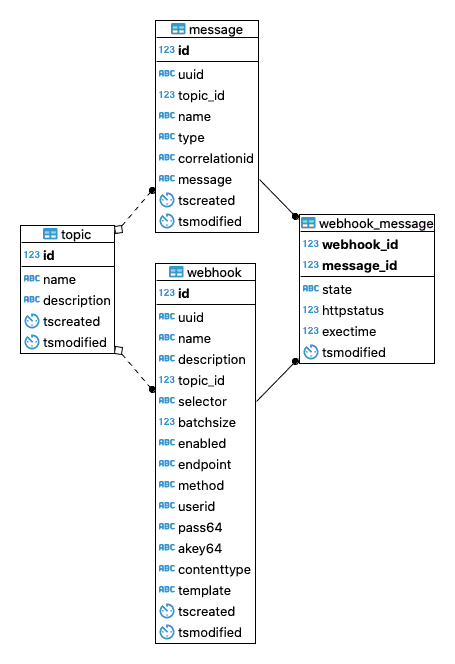

# Leitstand Event Queue Data Model

This document describes the data model of the _Leitstand Event Queue_,
which is implemented in a relational database. 

The event queue tables are located in the `bus` schema.

## Tables

### Entity-Relationship Diagram

 

### `message` Table
The `message` table stores domain events.

#### Columns

| Column        | Type          | Description                         |
|:--------------|:--------------|:------------------------------------|
| ID 	        | INT8          | Contiguous number as primary key.   |
| UUID          | CHARACTER(36) | Unique message ID in UUIDv4 format. |
| TOPIC_ID      | INT8          | Reference to the message topic.     |
| NAME          | VARCHAR(128)  | Domain event name.                  |
| TYPE          | VARCHAR(128)  | Domain event type.                  |
| CORRELATIONID | VARCHAR(64)   | Domain event correlation ID.        |
| MESSAGE       | TEXT          | The message payload.                |
| TSCREATED     | TIMESTAMP     | Creation timestamp.                 |
| TSMODIFIED    | TIMESTAMP     | Last-modification timestamp.        |

#### Primary Key
The `ID` column forms the primary key.

#### Unique Constraints
The `UUID` column must be unique for all messages.

#### Foreign Keys
The `TOPIC_ID` refers to the `ID` column of the `topic` table.

### `topic` Table
The `topic` table stores the existing topics.

#### Columns

| Column      | Type          | Description                       |
|:------------|:--------------|:----------------------------------|
| ID          | INT8          | Contiguous number as primary key. |
| NAME        | VARCHAR(64)   | Unique, descriptive topic name.   |
| DESCRIPTION | VARCHAR(1024) | Optional topic description.       |
| TSCREATED   | TIMESTAMP     | Creation timestamp.               |
| TSMODIFIED  | TIMESTAMP     | Last-modification timestamp.      |

#### Primary Key
The `ID` column forms the primary key.

#### Unique Constraints
The `NAME` column value must be unique for each topic.

### `webhook` Table
The `webhook` table contains the settings of each webhook.

#### Columns
| Column      | Type          | Description                                        |
|:------------|:--------------|:---------------------------------------------------|
| ID          | INT8          | Contiguous number as primary key.                  |
| UUID        | CHARACTER(36) | Unique webhook ID in UUIDv4 format.                |
| NAME        | VARCHAR(128)  | Unique, descriptive webhook name.                  |
| DESCRIPTION | VARCHAR(1024) | Optional webhook description.                      |   
| TOPIC_ID    | INT8          | Reference to the topic record.                     |
| SELECTOR    | VARCHAR(256)  | Optional message selector expression.              |
| BATCHSIZE   | INT4          | Batch size.                                        |   
| ENABLED     | CHARACTER(1)  | Whether the webhook is enabled (Y) or not (N).     |
| ENDPOINT    | VARCHAR(256)  | The webhook endpoint URL.                          |
| METHOD      | VARCHAR(8)    | The HTTP request method.                           |
| USERID      | VARCHAR(128)  | The user ID for HTTP basic authentication.         |
| PASS64      | VARCHAR       | The encrypted password for basic authentication.   |
| AKEY64      | VARCHAR       | The encrypted bearer token.                        |
| CONTENTTYPE | VARCHAR(32)   | The content type of the tranlsated request entity. |
| TEMPLATE    | VARCHAR       | Optional template to translate the request entity. |
| TSCREATED   | TIMESTAMP     | Creation timestamp.                                |
| TSMODIFIED  | TIMESTAMP     | Last-modification timestamp.                       |

#### Primary Key
The `ID` column forms the primary key.

#### Unique Constraints
The `UUID` column must be unique for each webhook.

#### Foreign Keys
The `TOPIC_ID` refers to the `ID` column of the `topic` table.

### `webhook_message` Table
The `webhook_message` table contains the message queue for each webhook.

#### Columns

| Column     | Type        | Description                      |
|:-----------|:------------|:---------------------------------|
| WEBHOOK_ID | INT8        | Reference to the webhook record. |
| MESSAGE_ID | INT8        | Reference to the message record. |
| STATE      | VARCHAR(16) | Message processing state.        |
| HTTPSTATUS | INT4        | HTTP response status code.       |
| EXECTIME   | INT8        | Execution time in milliseconds.  |

The following message processing states exist:
- `PENDING`, a new message that has not yet been processed
- `IN_PROGRESS`, a message that is currently in progress
- `SUCCEEDED`, a successfully processed message
- `FAILED`, a failed message

#### Primary Key
The `WEBHOOK_ID` and `MESSAGE_ID` columns form the primary key.

#### Foreign Keys
The `webhook_message` table has two foreign keys:
- The `WEBHOOK_ID` column refers to the `ID` column of the `webhook` table.
- The `MESSAGE_ID` column refers to the `ID` column of the `message` table.