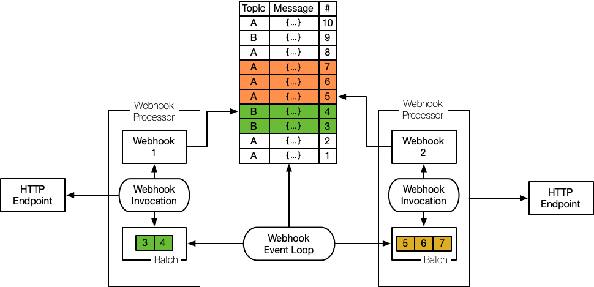

# Leitstand Webhooks

Leitstand webhooks forward domain events to configurable HTTP endpoints.

## Webhook Settings

### General Settings
Each webhook has a unique ID in UUIDv4 format, 
a unique human-friendly name and an optional description.

### Event Subscription
Each webhook subscribes for a _topic_ and can provide an optional _selector_ to subscribe for certain events only.
The selector is a regular expression.
The webhook processes only events with an event name that matches the selector expression.

The _batch size_ defines the maximum number of webhook calls that are scheduled in one go.
Each batch is executed in a dedicated thread.
The webhook invocations of a batch are executed sequentially.

### HTTP Endpoint Configuration

The minimal HTTP endpoint configuration consists of the endpoint URL and the HTTP request method, which is either `PUT` or `POST`.

#### HTTP Endpoint URL Template
The HTTP endpoint URL can be a template and has access to all properties of the domain event including the domain event payload.

Given the endpoint template 
`http://webhook.leitstand.io/api/v1/{{element_role}}/{{element_name}}/{{image.image_name}}-{{image.image_version}}`
and the below domain event

```JSON
{"event_id":"a74e555a-fca3-4a2b-a1d1-248695ddb93b",
 "event_name":"ElementImageUpgraded",
 "group_id":"8d9adb51-f1b3-4605-8474-b3a228092ef1",
 "group_type":"pod",
 "group_name":"pod1.lab.leitstand.io",
 "element_id":"1abe3b02-9bf7-423e-a3fc-5356f98080b3",
 "element_role":"LEAF",
 "element_name":"l1.pod1",
 "image":{ "image_id":"832f1c86-18b4-424c-bc38-4123dffe730f",
 		  "image_state":"CANDIDATE",
 		  "image_name":"access-leaf-nos",
 		  "image_version":"2.1.3"}
}
```
then the endpoint resolves to `http://webhook.leitstand.io/api/v1/LEAF/l1.pod1/access-leaf-nos-2.1.3`.


#### HTTP Endpoint Authentication
The webhooks support three different authentication schemes:
- Bearer Tokens
- HTTP Basic Authentication and
- Unauthenticated webhook invocations

##### Bearer Token
A bearer token is a pre-shared secret conveyed in the HTTP `Authorization` header to authorize the request.

The bearer token is protected by the Leitstand _master secret_ and stored AES-encrypted in the database.

##### Basic Authentication
HTTP Basic Authentication conveys Base64-encoded user password credentials in the HTTP `Authorization` header to authorize the request.

The password is protected by the Leitstand _master secret_ and stored AES-encrypted in the database.

##### Unauthenticated
Unauthenticated is the default authentication mode. 
It means that the requests contains no data to authorize the request. 

### Message Template
A message template allows to rewrite the domain event before it is send to the HTTP endpoint.

## Webhook Message Queue

Each webhook maintains a private persistent queue to maintain the domain events to be processed.

### Operational State
A webhook can be enabled or disabled.

A disabled webhook does not forward any domain event to the configured endpoint.
If a disabled webhook gets enabled, all messages that occurred while the webhook was disabled are processed by means of being forwarded to the configured endpoint.

Webhooks therefore guarantee that messages are processed _at least once_.

### Reset
A webhook can be reset to an already processed domain event.
The domain event and all domain events that were fired after this particular domain event will be processed again.
This allows to reprocess a series of domain events, after a defect in the webhook endpoint has been fixed.

### Retry
A retry resets all messages marked as failed in order to become eligible for processing again.

### Statistics
The queue statistics provides the following summary statistics for each webhook message queue:

- Number of pending messages.
- Number of messages in progress.
- Number of successfully processed messages.
- Min, avg, max, and stddev execution time of successfully processed messages.
- Number of failed messages.
- Min, avg, max, and stddev execution time of failed messages.

## Webhook Event Loop

The webhook event loop selects domain events eligible for execution and forwards them to the webhook endpoint by means of submitting HTTP requests. 



Each webhook keeps track of the processed messages and the result of the message processing.

The webhook event loop loads up to batch-size messages per webhook and runs each batch in a dedicated thread.
The thread is returned to the thread pool if the complete batch has been processed.

The webhook event loop can be stopped to suspend domain event processing completely.